# emmanuelygr

### $ whoami

**Aspiring Cybersecurity Professional**

Building practical cybersecurity skills through hands-on labs, Linux, networking, scripting, and security projects.

 

  

---

## ~/security

[+] SOC / Security Operations  
[+] Linux  
[+] Networking & HTTP  
[+] Python  
[+] SQL  
[+] SIEM  
[+] Web Security

---

## ~/labs

Currently practicing through:

- Hack The Box
- TryHackMe
- Linux security labs
- Networking and HTTP exercises
- Web security exercises
- Security automation with Python

---

## ~/projects

Building practical projects as I learn.

- **Security Labs** — Hands-on cybersecurity practice
- **Linux Security** — Linux administration and security
- **Python Security Tools** — Automation and scripting
- **Web Security** — HTTP, requests and web fundamentals

---

## ~/learning

Cybersecurity Fundamentals  
Linux  
Networking  
HTTP  
SQL  
SIEM  
Python  
Web Security

---

## ~/terminal

$ echo "keep learning"

keep learning

$ echo "keep practicing"

keep practicing

$ echo "build > watch"

build > watch

---

### SECURITY • LINUX • NETWORKING • PYTHON

Germany · Spanish / English

